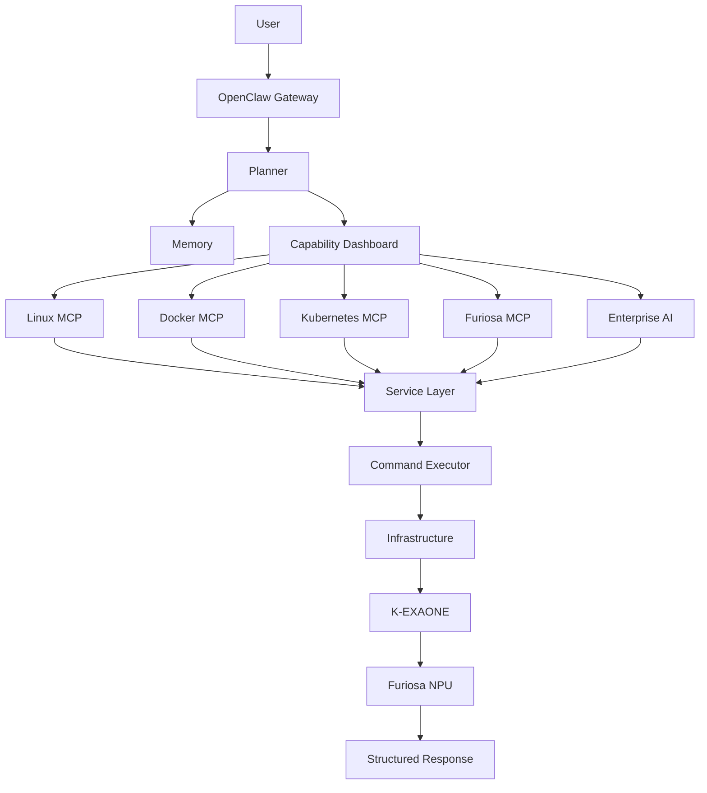

# 🚀 NPU Agentic Platform

<p align="center">

<h3 align="center">
Enterprise Agentic AI Operations Platform
</h3>

<p align="center">
Powered by <strong>OpenClaw</strong> • <strong>K-EXAONE</strong> • <strong>Furiosa NPU</strong> • <strong>Model Context Protocol (MCP)</strong>
</p>

<p align="center">

AI Agents that can **Understand • Reason • Plan • Observe • Operate**

</p>

---


</p>

---

# 🌟 Overview

**NPU Agentic Platform** is an enterprise-grade AI Operations Platform that combines **OpenClaw**, **K-EXAONE**, **Furiosa NPU**, and the **Model Context Protocol (MCP)** into a unified runtime for intelligent infrastructure automation.

Unlike traditional LLM applications that only generate responses, **NPU Agentic Platform enables AI Agents to understand, reason, observe, and execute real-world operations** across enterprise infrastructure using natural language.

The platform provides a modular architecture where infrastructure capabilities are exposed as MCP services, allowing AI Agents to interact with Linux systems, Docker containers, Kubernetes clusters, enterprise knowledge, and AI accelerators through a consistent interface.

---

# 🚀 Platform Capabilities

| Domain                       | Capability                                       |
| ---------------------------- | ------------------------------------------------ |
| 🤖 AI Runtime                | OpenClaw Gateway, Planner, Memory, Tool Calling  |
| 🧠 Large Language Model      | K-EXAONE                                         |
| 🚀 AI Accelerator            | Furiosa Runtime & NPU                            |
| 🖥 Infrastructure Operations | Linux, Docker, Kubernetes                        |
| 📊 AI Operations             | Capability Dashboard, Health Analyzer            |
| 🌐 Enterprise AI             | Web Search, Retrieval-Augmented Generation (RAG) |
| 👁 Vision AI                 | Image Understanding & Generation                 |
| 📱 Device Integration        | Android Agent                                    |

---

# 💡 Why NPU Agentic Platform?

Traditional AI assistants are primarily designed to answer questions.

NPU Agentic Platform goes beyond conversation by enabling AI Agents to execute real infrastructure operations through standardized MCP interfaces.

| Traditional LLM    | NPU Agentic Platform          |
| ------------------ | ----------------------------- |
| Answer Questions   | Understand Infrastructure     |
| Generate Text      | Reason & Plan                 |
| Passive Assistant  | Execute Actions               |
| Limited Tool Usage | Enterprise Tool Orchestration |
| Text Output        | Infrastructure Operations     |
| Single Interaction | Continuous AI Operations      |

---

# 🏗 Enterprise Architecture

```text
                                     Android Tablet
                                            │
                                   HTTPS / WebSocket
                                            │
                                            ▼
                              +----------------------------+
                              |     OpenClaw Gateway       |
                              +-------------+--------------+
                                            │
                              Planner / Memory / Tool Calling
                                            │
                                            ▼
                              +----------------------------+
                              |    Capability Dashboard    |
                              +-------------+--------------+
                                            │
        ┌───────────────────────┼───────────────────────────────┐
        │                       │                               │
        ▼                       ▼                               ▼
 +----------------+     +----------------+             +----------------+
 | Infrastructure |     |  Enterprise AI |             | Device Control |
 +--------+-------+     +--------+-------+             +--------+-------+
          │                      │                              │
          ▼                      ▼                              ▼
 +----------------+      +---------------+             +----------------+
 |   Linux MCP    |      |    Web MCP    |             | Android Agent  |
 |   Docker MCP   |      |    RAG MCP    |             +----------------+
 | Kubernetes MCP |      |  Vision MCP   |
 | Furiosa MCP    |      +---------------+
 +--------+-------+
          │
          ▼
 +----------------------------+
 |        Service Layer        |
 +-------------+--------------+
               │
               ▼
 +----------------------------+
 |     Command Executor       |
 +-------------+--------------+
               │
               ▼
 +--------------------------------------------------------------+
 | Linux CLI | Docker Engine | Kubernetes API | Furiosa Runtime |
 +---------------------------+----------------------------------+
                             │
                             ▼
                      +----------------+
                      |  K-EXAONE LLM  |
                      +--------+-------+
                               │
                               ▼
                      +----------------+
                      |  Furiosa NPU   |
                      +----------------+
```

---

# 🎯 Core Design Principles

* **Natural Language First** — Operate infrastructure through conversational AI.
* **MCP-Native Architecture** — Modular, extensible services based on the Model Context Protocol.
* **Enterprise Ready** — Designed for production environments and AI Operations.
* **Hardware Accelerated** — Optimized for Furiosa NPU inference.
* **Service-Oriented Design** — Clear separation between tools, services, and execution layers.
* **Extensible Platform** — New capabilities can be added as independent MCP modules.
* **Unified AI Operations** — Linux, Docker, Kubernetes, NPU, RAG, Vision, and mobile integration under a single AI runtime.

---

# 📈 High-Level Workflow



---

# 🧩 Platform Components

NPU Agentic Platform is composed of independent yet tightly integrated platform modules. Each component has a clearly defined responsibility and can evolve independently while sharing a common MCP interface.

| Component             | Responsibility                                           |
| --------------------- | -------------------------------------------------------- |
| OpenClaw Gateway      | Agent Runtime, Session Management and Tool Calling       |
| Planner               | Task decomposition and execution planning                |
| Memory                | Context retention and long-term memory                   |
| Capability Dashboard  | Dynamic runtime capability discovery                     |
| MCP Framework         | Standardized communication between AI and external tools |
| Service Layer         | Business logic abstraction                               |
| Command Executor      | Secure command execution engine                          |
| Linux Operations      | Infrastructure management                                |
| Docker Operations     | Container lifecycle management                           |
| Kubernetes Operations | Cluster administration                                   |
| Furiosa Runtime       | NPU runtime integration                                  |
| Enterprise AI         | RAG, Search and AI services                              |
| Android Agent         | Mobile device integration                                |

---

# 🛠 Enterprise Services

The platform exposes infrastructure functionality through reusable enterprise services.

## Linux Operations

Supported capabilities include:

* Hostname
* CPU Information
* Memory Usage
* Disk Usage
* Network Information
* Process Monitoring
* System Uptime
* Current User
* systemctl
* journalctl

---

## Docker Operations

Container lifecycle management through MCP.

Capabilities include:

* Running Containers
* Container Logs
* Container Statistics
* Images
* Inspect
* Health Information

---

## Kubernetes Operations

Enterprise Kubernetes administration.

Capabilities include:

* Cluster Information
* Node Status
* Pod Status
* Deployments
* Services
* Events
* Describe Resources
* Logs
* Health Analysis

---

## Furiosa Operations

Hardware-accelerated AI infrastructure monitoring.

Capabilities include:

* Runtime Information
* Device Discovery
* NPU Utilization
* Memory Usage
* Temperature
* Power Status
* Runtime Health
* AI Accelerator Diagnostics

---

## Enterprise AI Services

AI-native enterprise capabilities.

Supported services include:

* Retrieval-Augmented Generation (RAG)
* Web Search
* Knowledge Retrieval
* Vision AI
* Image Understanding
* Image Generation
* Enterprise Workflow Automation

---

# 📂 Repository Structure

```text
NPU-Agentic-Platform/

├── system-mcp/
│
│   ├── src/
│   │
│   ├── core/
│   │   ├── CommandExecutor.ts
│   │   ├── ToolRegistry.ts
│   │   ├── ToolTypes.ts
│   │   ├── ResponseFormatter.ts
│   │   └── HealthAnalyzer.ts
│   │
│   ├── services/
│   │   ├── LinuxService.ts
│   │   ├── DockerService.ts
│   │   ├── KubernetesService.ts
│   │   ├── FuriosaService.ts
│   │   └── OpenClawService.ts
│   │
│   ├── system/
│   │
│   ├── tools/
│   │   ├── capability/
│   │   ├── linux/
│   │   ├── docker/
│   │   ├── kubernetes/
│   │   ├── furiosa/
│   │   ├── filesystem/
│   │   └── logs/
│   │
│   ├── utils/
│   └── types/
│
├── docs/
├── examples/
├── deployment/
├── scripts/
└── README.md
```

---

# ⚙ Technology Stack

| Category           | Technology                                                 |
| ------------------ | ---------------------------------------------------------- |
| Agent Runtime      | OpenClaw                                                   |
| LLM                | K-EXAONE                                                   |
| AI Accelerator     | Furiosa NPU                                                |
| Runtime            | Furiosa Runtime                                            |
| Protocol           | Model Context Protocol (MCP)                               |
| Language           | TypeScript                                                 |
| Backend            | Node.js                                                    |
| Container Platform | Docker                                                     |
| Orchestration      | Kubernetes                                                 |
| Database           | MongoDB                                                    |
| Vector Search      | MongoDB Atlas Search / Vector Search (Planned Integration) |
| API                | OpenAI Compatible API                                      |
| Mobile             | Android                                                    |
| Operating System   | Ubuntu Linux                                               |

---

# ⭐ Platform Highlights

## Unified AI Operations

Operate Linux, Docker, Kubernetes and AI infrastructure from a single conversational interface.

---

## Modular MCP Architecture

Every capability is implemented as an independent MCP module, making the platform highly extensible.

---

## Capability Dashboard

AI Agents automatically discover available runtime capabilities instead of relying on predefined tool lists.

---

## Enterprise Infrastructure Automation

Execute operational tasks using natural language without switching between multiple administration tools.

---

## Hardware Accelerated AI

Designed for high-performance inference using the Furiosa Runtime and K-EXAONE models.

---

## Production-Oriented Design

Built around reusable services, modular architecture and enterprise deployment patterns suitable for real-world environments.

---

# 🚀 Quick Start

Clone the repository and install dependencies.

```bash
git clone https://github.com/nanuwa/NPU-Agentic-Platform.git

cd NPU-Agentic-Platform/system-mcp

npm install

npm run build

npm start
```

---

# 💬 Example Natural Language Operations

The following examples demonstrate how AI Agents interact with enterprise infrastructure through natural language.

---

## Linux Operations

```text
"Show the current hostname."

"How much memory is available?"

"Analyze disk usage."

"Display CPU utilization."

"Check current network interfaces."

"Summarize today's system logs."

"Who is currently logged in?"

"How long has this server been running?"
```

---

## Docker Operations

```text
"Show all running Docker containers."

"List available Docker images."

"Analyze container resource usage."

"Show logs from the API container."

"Inspect this container."

"Which containers are unhealthy?"
```

---

## Kubernetes Operations

```text
"Show all Pods."

"Are there any failed Pods?"

"Display Node status."

"Summarize cluster health."

"Show recent Kubernetes events."

"Describe this Deployment."

"Analyze Restart counts."

"Find unhealthy workloads."
```

---

## Furiosa NPU Operations

```text
"Check current NPU utilization."

"Show runtime information."

"Display NPU memory usage."

"Analyze device health."

"Check runtime status."

"Show inference performance."

"Display power consumption."

"Summarize accelerator status."
```

---

## Enterprise AI

```text
"Search enterprise documentation."

"Summarize today's incidents."

"Find deployment instructions."

"Retrieve internal knowledge."

"Generate an image from this prompt."

"Analyze this architecture diagram."

"Summarize uploaded documents."
```

---

# 📊 Capability Dashboard

One of the platform's core capabilities is dynamic runtime discovery.

Instead of relying on static tool definitions, AI Agents automatically discover available platform capabilities at runtime.

Example:

```text
========================================================

        NPU Agentic Platform Capability Dashboard

========================================================

AI Runtime

  ✓ OpenClaw Gateway

  ✓ Planner

  ✓ Memory

  ✓ Tool Calling

--------------------------------------------------------

Infrastructure

  ✓ Linux Operations

  ✓ Docker Operations

  ✓ Kubernetes Operations

  ✓ Furiosa Operations

--------------------------------------------------------

Enterprise AI

  ✓ Web Search

  ✓ Enterprise RAG

  ✓ Vision AI

--------------------------------------------------------

Device Integration

  ✓ Android Agent

--------------------------------------------------------

Platform Services

  ✓ Capability Dashboard

  ✓ Health Analyzer

========================================================
```

The Capability Dashboard provides a unified overview of the services available to AI Agents, making the platform self-describing and easier to extend.

---

# ❤️ AI Health Analyzer

The AI Health Analyzer combines infrastructure metrics from multiple domains and produces an AI-generated operational summary.

Example analysis:

```text
Infrastructure Summary

Cluster Status

✓ Kubernetes Healthy

Docker

✓ All Containers Running

Linux

✓ CPU 18%

✓ Memory 62%

✓ Disk 44%

Furiosa Runtime

✓ Runtime Active

✓ NPU Healthy

Overall Platform Health

★★★★★ Excellent
```

This enables operators to understand platform health without manually inspecting multiple monitoring tools.

---

# 📸 Demonstrations

The following demonstrations are planned for publication.

| Demonstration         | Description                                 |
| --------------------- | ------------------------------------------- |
| System MCP            | Linux administration using natural language |
| Docker Operations     | Container lifecycle management              |
| Kubernetes Operations | Cluster monitoring and diagnostics          |
| Furiosa Runtime       | NPU monitoring and performance analysis     |
| Capability Dashboard  | Runtime capability discovery                |
| Enterprise RAG        | Knowledge retrieval workflows               |
| Vision AI             | Image understanding and generation          |
| Android Agent         | Remote AI operations from Android devices   |

---

# 🖼 Screenshots

Screenshots will be added as the platform evolves.

Planned screenshots include:

* OpenClaw Dashboard
* Capability Dashboard
* Linux Operations
* Docker Operations
* Kubernetes Monitoring
* Furiosa Runtime
* AI Health Analyzer
* Android Agent

---

# 🎥 Videos

Planned video content:

* Platform Overview
* OpenClaw Setup
* System MCP Walkthrough
* Docker Administration
* Kubernetes Operations
* Furiosa Runtime Monitoring
* Enterprise RAG
* Vision AI
* Android Agent Demonstration

GIF previews and YouTube walkthroughs will be published as the platform continues to evolve.

---

# 📈 Current Platform Scope

The platform is designed to provide a unified AI Operations environment capable of managing enterprise infrastructure through conversational interfaces.

Current architectural domains include:

* AI Runtime
* Infrastructure Operations
* Container Management
* Kubernetes Administration
* AI Accelerator Monitoring
* Enterprise Knowledge
* Vision AI
* Mobile Integration

The modular MCP architecture allows additional capabilities to be introduced without changing the overall platform design.

---

# 📚 Documentation

Detailed technical documentation is organized under the `docs/` directory.

```text
docs/

├── README.md                    # Documentation Portal
│
├── architecture/
│   ├── ARCHITECTURE.md
│   ├── SYSTEM_ARCHITECTURE.md
│   ├── MCP_ARCHITECTURE.md
│   └── FURIOSA_RUNTIME.md
│
├── system-mcp/
│   ├── OVERVIEW.md
│   ├── LINUX_MCP.md
│   ├── DOCKER_MCP.md
│   ├── KUBERNETES_MCP.md
│   ├── FURIOSA_MCP.md
│   └── CAPABILITY_DASHBOARD.md
│
├── setup/
│   ├── INSTALL.md
│   ├── OPENCLAW.md
│   ├── K_EXAONE.md
│   ├── FURIOSA.md
│   └── DEVELOPMENT.md
│
├── deployment/
│   ├── DOCKER.md
│   ├── KUBERNETES.md
│   ├── ONPREM.md
│   └── PRODUCTION.md
│
├── api/
│   ├── MCP_API.md
│   ├── TOOL_CALLING.md
│   └── OPENAI_API.md
│
├── examples/
│   ├── NATURAL_LANGUAGE.md
│   ├── TOOL_CALLING.md
│   └── DEMO.md
│
├── images/
│
└── videos/
```

The documentation is intended to evolve into a complete developer guide covering architecture, deployment, APIs, implementation details, and operational best practices.

---

# 🗺 Product Roadmap

The platform follows an incremental, capability-driven roadmap.

| Version  | Major Features                            |
| -------- | ----------------------------------------- |
| **v0.1** | OpenClaw Platform Foundation              |
| **v0.2** | System MCP Framework                      |
| **v0.3** | Linux & Docker Operations                 |
| **v0.4** | Kubernetes Operations                     |
| **v0.5** | Furiosa Runtime Integration               |
| **v0.6** | Capability Dashboard & AI Health Analyzer |
| **v0.7** | Enterprise RAG                            |
| **v0.8** | Vision AI                                 |
| **v0.9** | Android Agent                             |
| **v1.0** | Enterprise Agentic AI Operations Platform |

---

# 🌍 Future Platform Vision

NPU Agentic Platform is designed to become a unified AI Operations Platform where intelligent agents can seamlessly interact with enterprise infrastructure.

Future platform capabilities include:

* Multi-Agent Collaboration
* AI-native Infrastructure Automation
* Distributed MCP Services
* Enterprise Workflow Orchestration
* Hybrid Cloud Management
* GPU/NPU Resource Scheduling
* Knowledge Graph Integration
* Autonomous Operations (AIOps)
* Digital Twin Integration
* Enterprise AI Marketplace

---

# 🤝 Contributing

Contributions are welcome from developers, researchers, and AI enthusiasts.

Areas of contribution include:

* MCP Tool Development
* Infrastructure Automation
* Kubernetes Integration
* Furiosa Runtime Optimization
* Enterprise AI Services
* Documentation
* Testing & Benchmarking
* Tutorials and Examples

Please submit issues or pull requests following the project's contribution guidelines.

---

# 📖 Related Technologies

The platform is built around modern enterprise AI technologies.

| Technology                   | Purpose                      |
| ---------------------------- | ---------------------------- |
| OpenClaw                     | Agent Runtime                |
| Model Context Protocol (MCP) | Standard Tool Interface      |
| K-EXAONE                     | Large Language Model         |
| Furiosa Runtime              | AI Inference Runtime         |
| Furiosa NPU                  | AI Accelerator               |
| Docker                       | Container Platform           |
| Kubernetes                   | Container Orchestration      |
| MongoDB                      | Enterprise Data Platform     |
| TypeScript                   | Primary Development Language |
| Node.js                      | Runtime Environment          |

---

# 📊 Project Philosophy

The long-term goal of this project is not simply to build another chatbot.

Instead, NPU Agentic Platform aims to bridge the gap between Large Language Models and real-world enterprise infrastructure.

The platform is designed around five core principles:

* **Understand** — Interpret natural language and infrastructure context.
* **Reason** — Analyze operational conditions using AI.
* **Plan** — Select the appropriate tools and execution strategy.
* **Observe** — Monitor infrastructure continuously.
* **Operate** — Execute infrastructure actions safely through MCP.

These principles define the foundation of an Enterprise Agentic AI Operations Platform.

---

# 📄 License

This project is released under the **MIT License**.

You are free to use, modify, and distribute the software in accordance with the terms of the license.

---

# ⭐ Support the Project

If you find this project useful, consider supporting it by:

* ⭐ Starring the repository
* 🍴 Forking the project
* 🐞 Reporting issues
* 💡 Suggesting new features
* 📢 Sharing the project with the community

Community contributions help improve the platform for everyone.

---

# ❤️ Acknowledgements

Special thanks to the communities and technologies that make this project possible.

* OpenClaw
* FuriosaAI
* LG AI Research (K-EXAONE)
* Model Context Protocol (MCP)
* Docker
* Kubernetes
* Node.js
* TypeScript
* Open Source Community

---

<p align="center">

## 🚀 NPU Agentic Platform

**Enterprise Agentic AI Operations Platform**

Powered by **OpenClaw • K-EXAONE • Furiosa NPU • Model Context Protocol**

**Understand • Reason • Plan • Observe • Operate**

---

Building the next generation of AI-powered infrastructure operations.

⭐ **If this project helps you, please consider giving it a Star!**

</p>


