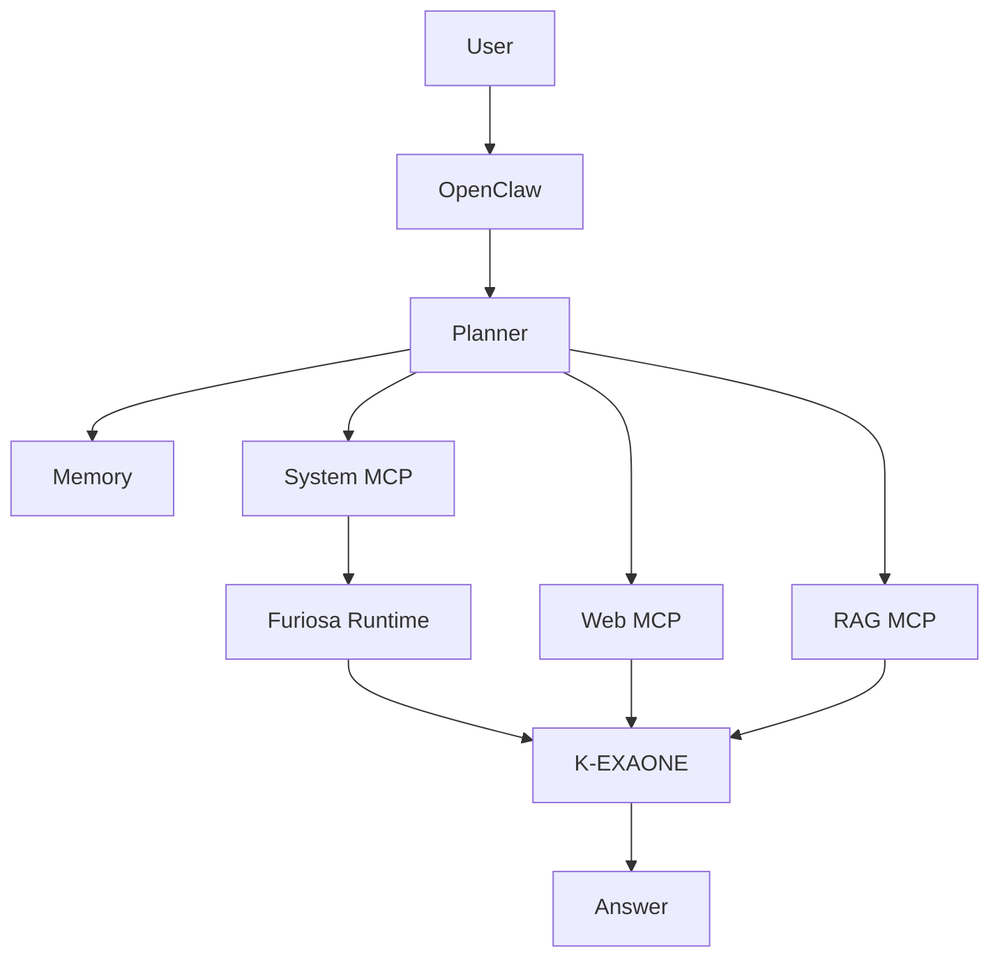

# 🚀 NPU Agentic Platform

<p align="center">

**Enterprise Agentic AI Platform powered by OpenClaw, K-EXAONE and Furiosa NPU**

Build intelligent AI Agents that can understand, reason, search, operate Linux systems, control Kubernetes, interact with Docker, perform Retrieval-Augmented Generation (RAG), execute Vision AI workflows, and orchestrate enterprise infrastructure through the **Model Context Protocol (MCP)**.

---


</p>

---

# 🌟 Overview

NPU Agentic Platform is an enterprise-grade Agentic AI platform designed to integrate Large Language Models with real-world infrastructure.

Instead of answering questions only, the platform enables AI Agents to perform actual operations through tools.

Examples include:

* Linux server management
* Docker operations
* Kubernetes operations
* Furiosa NPU monitoring
* Web Search
* GitHub integration
* Retrieval-Augmented Generation (RAG)
* Vision AI
* Android Agent
* Enterprise workflow automation

The platform uses **OpenClaw** as the Agent runtime and **Model Context Protocol (MCP)** as the standard interface between AI Agents and external tools.

---

# 🎬 Demo

> **Coming Soon**

The following demonstrations will be published as development progresses.

* System MCP Demo
* Furiosa NPU Monitoring
* Kubernetes Operations
* Android Tablet Control
* Vision AI
* RAG Assistant

### GIF Preview

```
docs/demo/demo.gif
```

### YouTube

```
https://youtube.com/...
```

---

# 🏗 Architecture

## Enterprise Architecture

```
                                     Android Tablet
                                            │
                                            │
                                    HTTPS / WebSocket
                                            │
                                            ▼
                                +-----------------------+
                                |    OpenClaw Gateway   |
                                +-----------+-----------+
                                            │
                                  Planner / Memory
                                            │
                    ┌───────────────────────┼────────────────────────┐
                    │                       │                        │
                    ▼                       ▼                        ▼
             +-------------+        +--------------+        +--------------+
             | System MCP  |        |   Web MCP    |        |   RAG MCP    |
             +------+------+        +------+-------+        +------+-------+
                    │                      │                       │
                    │                      │                       │
      ┌─────────────┼─────────────┐        │             ┌─────────┼────────┐
      ▼             ▼             ▼        ▼             ▼         ▼        ▼
 Linux        Docker       Kubernetes   Search      VectorDB  Embedding  PDF
 Tools         Tools          Tools       APIs        Engine     Models
      │
      ▼
 Furiosa Runtime
      │
      ▼
 K-EXAONE LLM
```

---

# 📈 High-Level Workflow



---

# 🧩 Platform Components

| Component        | Description                 | Status |
| ---------------- | --------------------------- | ------ |
| OpenClaw Gateway | Agent Runtime               | ✅      |
| K-EXAONE         | Large Language Model        | ✅      |
| Furiosa Runtime  | NPU Inference               | ✅      |
| MCP SDK          | Model Context Protocol      | ✅      |
| TypeScript SDK   | Tool Development            | ✅      |
| System MCP       | Linux Operations            | 🚧     |
| Web MCP          | Internet Search             | ⏳      |
| RAG MCP          | Enterprise Knowledge        | ⏳      |
| Vision MCP       | Image Generation & Analysis | ⏳      |
| Android Agent    | Mobile Control              | ⏳      |

---

# 📁 Repository Structure

```
NPU-Agentic-Platform/

├── system-mcp/
├── web-mcp/
├── rag-mcp/
├── vision-mcp/
├── android-agent/
├── deployment/
│   ├── docker/
│   └── kubernetes/
├── docs/
│   ├── architecture/
│   ├── roadmap/
│   ├── setup/
│   ├── development/
│   ├── deployment/
│   ├── images/
│   └── demo/
├── examples/
└── README.md
```

---

# ⚙ Technology Stack

| Category        | Technology                   |
| --------------- | ---------------------------- |
| AI Runtime      | OpenClaw                     |
| LLM             | K-EXAONE                     |
| Accelerator     | Furiosa NPU                  |
| Tool Protocol   | Model Context Protocol (MCP) |
| Backend         | Node.js                      |
| Language        | TypeScript                   |
| Container       | Docker                       |
| Orchestration   | Kubernetes                   |
| Vector Database | MongoDB                      |
| Mobile          | Android                      |
| API             | OpenAI Compatible API        |

---

# 🛠 MCP Services

| MCP Service      | Description                    | Status |
| ---------------- | ------------------------------ | ------ |
| Linux Tools      | hostname, uptime, memory, disk | 🚧     |
| Docker Tools     | containers, logs, images       | 🚧     |
| Kubernetes Tools | nodes, pods, events            | 🚧     |
| Furiosa Tools    | NPU monitoring                 | 🚧     |
| GitHub MCP       | Repository operations          | ⏳      |
| Web Search MCP   | Search engine integration      | ⏳      |
| Weather MCP      | Weather services               | ⏳      |
| RAG MCP          | Enterprise Knowledge Search    | ⏳      |
| Vision MCP       | Image Generation & Analysis    | ⏳      |

---

# 🚀 Development Roadmap

| Sprint    | Goal                   | Status         |
| --------- | ---------------------- | -------------- |
| Sprint 1  | OpenClaw Installation  | ✅ Complete     |
| Sprint 2A | MCP Foundation         | ✅ Complete     |
| Sprint 2B | System MCP Development | 🚧 In Progress |
| Sprint 3  | Web MCP                | ⏳ Planned      |
| Sprint 4  | Enterprise RAG         | ⏳ Planned      |
| Sprint 5  | Vision AI              | ⏳ Planned      |
| Sprint 6  | Android Agent          | ⏳ Planned      |

---

# 📷 Screenshots

> Coming Soon

* OpenClaw Dashboard
* Furiosa Runtime
* Kubernetes Cluster
* Android Tablet
* Vision AI
* RAG Workflow

---

# 🎥 Videos

Coming Soon

* OpenClaw Setup
* K-EXAONE Deployment
* MCP Development
* Docker Automation
* Kubernetes Operations
* Android Agent Demo

---

# 📚 Documentation

| Document          | Description          |
| ----------------- | -------------------- |
| docs/setup        | Installation Guide   |
| docs/development  | Development Guide    |
| docs/architecture | System Architecture  |
| docs/deployment   | Docker & Kubernetes  |
| docs/roadmap      | Sprint Roadmap       |
| docs/demo         | Demonstration Videos |

---

# 🎯 Project Vision

The long-term vision of **NPU Agentic Platform** is to provide a unified enterprise platform where AI Agents can:

* Understand natural language
* Execute infrastructure operations
* Manage Linux servers
* Control Docker and Kubernetes
* Monitor Furiosa NPUs
* Search enterprise knowledge
* Generate and analyze images
* Interact with Android devices
* Orchestrate enterprise AI workflows

Through OpenClaw and the Model Context Protocol, the platform bridges the gap between Large Language Models and real-world infrastructure.

---

# 🤝 Contributing

Contributions are welcome.

Please read the development guide before submitting pull requests.

---

# 📄 License

This project is released under the MIT License.

---

<p align="center">

**Built with ❤️ using OpenClaw, K-EXAONE, Furiosa NPU and the Model Context Protocol.**

</p>
